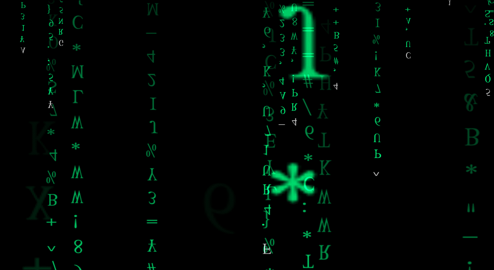
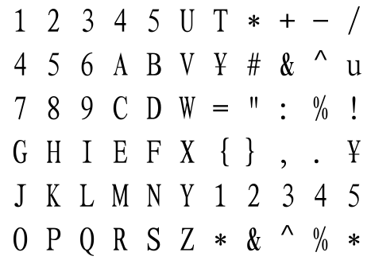

<!--BEGIN_DATA
{
    "create_date": "2023-06-11 08:30", 
    "modify_date": "2023-06-11 08:30", 
    "is_top": "0", 
    "summary": "", 
    "tags": "", 
    "file_name": ""
}
END_DATA-->

#### <p>原文出处：<a href='https://blog.csdn.net/qq_31615919/article/details/80007969' target='blank'>[OpenGL] OpenGL制作三维字符雨屏保程序</a></p>

## OpenGL制作炫酷字符雨屏保程序

  * 前言
  * OpenGL3.3+制作屏保程序
  * 将制作的程序运用到屏保
  * 效果展示

### 前言

之前早就想做个类似《黑客帝国》的数字雨屏保程序了，这次趁着有点时间做个三维效果的数字雨，就是有距离感而不单单是二维的数字雨效果。此屏保程序是居家旅行必备的装
逼神器，→_→炫酷的字符流，营造出一种神秘感。  
本工程项目及发布版本的scr屏保程序和exe程序在github可下载：  
<https://github.com/ZeusYang/Breakout/tree/master/MatrixSaver>  



### OpenGL3.3+制作屏保程序

##### 工具

OpenGL3.3+图形库、glm数学矩阵库、glfw创建窗口。

##### 字符纹理

数字雨中的字符可借用freetype实现，也可用一张纹理图片，这张纹理图片将需要显示的字符全部合成一张，然后通过改变纹理坐标来实现字符的变化。本人采用后者的
方法，用freetype实现的话需要不断切换纹理，非常耗费效率；而用纹理图片的话，由于纹理的分辨率导致放大产生的锯齿是它的缺点。本人采用的纹理如下所示：  



##### 窗口

本人采用glfw创建全屏的窗口，当然你要用win32也可以。glfw创建全屏窗口的代码如下，更多的细节请看源代码：

```cpp
//全屏显示
GLFWmonitor *pMonitor = glfwGetPrimaryMonitor();
const GLFWvidmode * mode = glfwGetVideoMode(pMonitor);
SCREEN_WIDTH = mode->width;
SCREEN_HEIGHT = mode->height;

GLFWwindow* window = glfwCreateWindow(SCREEN_WIDTH, SCREEN_HEIGHT, "Matrix", pMonitor, nullptr);
if (window == NULL) {
    std::cout << "Failed to create GLFW window" << std::endl;
    glfwTerminate();
    return -1;
}
```

##### 数字字符链

数字雨中每一条字符链我们采用链表实现，在字符雨下落的过程中，头部不断产生新的字符，而尾部则不断地删除消失，总的长度保持不变。单个字符的属性有位置、颜色、字符种类这三个属性，其中字符种类我们通过纹理坐标来指定每个字符，通过改变纹理坐标就能够索引到不同的字符。

```cpp
#pragma once
#include <list>
#include <glm/glm.hpp>

struct Symbol {//单个字符
    glm::vec4 Pos;//位置、大小
    glm::vec4 Color;//颜色
    glm::vec4 Coord;//纹理坐标的移动
};

class CharList{
public:
    CharList(float zn, float zf, float ap, float fy);

    ~CharList() = default;

    void Move(float dt);//移动

    bool IsOufScreen();//判断是否飘出屏幕外

    std::list<Symbol> necklace;

    glm::vec3 pos;//列尾位置
    glm::vec3 vel;//速度方向

    int num;//字符数量

private:
    //单个字符大小、近平面、远平面、宽高比、视锥范围夹角
    float size, znear, zfar, aspect, fovy;

    void RndPos();//随机位置

    inline float Rand0_1() {//0-1的随机数
        return (double)rand() / (double)RAND_MAX;
    }
};
```

##### 渲染精灵

一个字符就是一个图片，简单地写一个渲染循环一个个地draw是一种方法，但是这种方法效率极低，drawcall次数很大，特别是数量非常大的时候。为此，我采用了OpenGL3.3+的实例化特性。

```cpp
class SpriteRenderer{
public:
    SpriteRenderer(Shader &shader, float untiX, float unitY);
    ~SpriteRenderer();
    //实例化
    void SetInstance(const std::vector<CharList*> &target);
     //绘制精灵，除了纹理，其余参数都没用到
    void DrawSprite(Texture2D &texture, glm::vec2 position = glm::vec2(0, 0),
        glm::vec2 size = glm::vec2(10, 10), GLfloat rotate = 0.0f,
        glm::vec3 color = glm::vec3(1.0f));
private:
    int amount;//实例化的个数
    Shader shader;
    GLuint quadVAO;
    GLuint instanceVBO;
    void initRenderData(float untiX, float unitY);
};

#include "SpriteRenderer.h"
#include <iostream>

SpriteRenderer::SpriteRenderer(Shader &shader, float unitX, float unitY)
    :shader(shader), amount(0)
{
    this->initRenderData(unitX, unitY);
}

SpriteRenderer::~SpriteRenderer() {
    glDeleteVertexArrays(1, &this->quadVAO);
    glDeleteBuffers(1, &this->instanceVBO);
}

void SpriteRenderer::initRenderData(float unitX,float unitY)
{
    // 配置 VAO/VBO
    GLuint VBO;
    GLfloat vertices[] = {
        // 位置               // 纹理
        -0.5f, 0.5f,0.0f, 0.000f,  unitX,
         0.5f,-0.5f,0.0f,  unitY, 0.000f,
        -0.5f,-0.5f,0.0f, 0.000f, 0.000f,
        -0.5f, 0.5f,0.0f, 0.000f,  unitX,
         0.5f, 0.5f,0.0f,  unitY,  unitX,
         0.5f,-0.5f,0.0f,  unitY, 0.000f
    };

    glGenVertexArrays(1, &this->quadVAO);
    glGenBuffers(1, &instanceVBO);
    glGenBuffers(1, &VBO);
    glBindVertexArray(this->quadVAO);
    glBindBuffer(GL_ARRAY_BUFFER, VBO);
    glBufferData(GL_ARRAY_BUFFER, sizeof(vertices), vertices, GL_STATIC_DRAW);
    glEnableVertexAttribArray(0);
    glVertexAttribPointer(0, 3, GL_FLOAT, GL_FALSE, 5 * sizeof(GLfloat), (GLvoid*)0);
    glEnableVertexAttribArray(1);
    glVertexAttribPointer(1, 2, GL_FLOAT, GL_FALSE, 5 * sizeof(GLfloat), (GLvoid*)(3 * sizeof(GLfloat)));
    glBindBuffer(GL_ARRAY_BUFFER, 0);
    glBindVertexArray(0);
}

void SpriteRenderer::SetInstance(const std::vector<CharList*> &target) {
    //获取实例矩阵
    std::vector<glm::mat4> instance;
    amount = target.size()*target[0]->necklace.size();
    instance.reserve(amount);
    for (auto it = target.begin(); it != target.end(); ++it) {
        for (auto th = (*it)->necklace.begin(); th != (*it)->necklace.end(); ++th) {
            glm::mat4 tmp(1.0f);
            tmp[0] = th->Pos;
            tmp[1] = th->Color;
            tmp[2] = th->Coord;
            tmp[3] = glm::vec4(1.0f);
            instance.push_back(tmp);
        }
    }

    GLsizei vec4Size = sizeof(glm::vec4);
    glBindVertexArray(quadVAO);
    glBindBuffer(GL_ARRAY_BUFFER, instanceVBO);
    glBufferData(GL_ARRAY_BUFFER, instance.size() * sizeof(glm::mat4), &instance[0], GL_DYNAMIC_DRAW);
    glEnableVertexAttribArray(2);
    glVertexAttribPointer(2, 4, GL_FLOAT, GL_FALSE, 4 * vec4Size, (void*)0);
    glEnableVertexAttribArray(3);
    glVertexAttribPointer(3, 4, GL_FLOAT, GL_FALSE, 4 * vec4Size, (void*)(vec4Size));
    glEnableVertexAttribArray(4);
    glVertexAttribPointer(4, 4, GL_FLOAT, GL_FALSE, 4 * vec4Size, (void*)(2 * vec4Size));
    glEnableVertexAttribArray(5);
    glVertexAttribPointer(5, 4, GL_FLOAT, GL_FALSE, 4 * vec4Size, (void*)(3 * vec4Size));
    glVertexAttribDivisor(2, 1);
    glVertexAttribDivisor(3, 1);
    glVertexAttribDivisor(4, 1);
    glVertexAttribDivisor(5, 1);
    glBindBuffer(GL_ARRAY_BUFFER, 0);
    glBindVertexArray(0);
}

void SpriteRenderer::DrawSprite(Texture2D &texture, glm::vec2 position,
    glm::vec2 size, GLfloat rotate, glm::vec3 color){
    this->shader.Use();
    //绑定纹理
    glActiveTexture(GL_TEXTURE0);
    texture.Bind();
    glBindVertexArray(this->quadVAO);
    glDrawArraysInstanced(GL_TRIANGLES, 0, 6, amount);
    glBindVertexArray(0);
}
```

##### 渲染循环

**初始化：**

```cpp
//初始化
void Saver::Init() {
    // 加载着色器
    std::string vShader = 
        "#version 330 core\n"
        "layout(location = 0) in vec3 vertex;\n"
        "layout(location = 1) in vec2 texcoord;\n"
        "layout(location = 2) in mat4 instanceMatrix;\n"
        "out vec2 TexCoords;\n"
        "out vec4 Color;\n"
        "uniform mat4 projection;\n"
        "void main()\n"
        "{\n"
        "   //位置\n"
        "   vec3 pos = vertex + instanceMatrix[0].xyz;\n"
        "   pos *= instanceMatrix[0].w;\n"
        "   gl_Position = projection * vec4(pos, 1.0f);\n"
        "   //颜色\n"
        "   Color = instanceMatrix[1];\n"
        "   TexCoords.x = texcoord.x + 0.091f*instanceMatrix[2].x;\n"
        "   TexCoords.y = texcoord.y + 0.167f*instanceMatrix[2].y;\n"
        "}\n";

    std::string fShader =
        "#version 330 core\n"
        "in vec2 TexCoords;\n"
        "in vec4 Color;\n"
        "out vec4 color;\n"
        "uniform sampler2D image;\n"
        "void main() {\n"
        "   vec4 tex = texture(image, TexCoords);\n"
        "   color.xyz = Color.xyz;\n"
        "   color.w = (1.0 - tex.x)*Color.w;\n"
        "}\n";

    ResourceManager::LoadShaderFromString(vShader, fShader,  "sprite");

    /*ResourceManager::LoadShader("Sprite.vert",
        "Sprite.frag", nullptr, "sprite");*/
    // 加载纹理
    ResourceManager::LoadTexture("C:/Windows/number.png", GL_TRUE, "number");
    // 配置着色器
    glm::mat4 projection = glm::perspective(glm::radians(fovy), aspect, znear, zfar);
    ResourceManager::GetShader("sprite").Use().SetInteger("image", 0);
    ResourceManager::GetShader("sprite").SetMatrix4("projection", projection);
    
    //50个字符链
    for (auto x = 0; x < 200; ++x) {
        matrix.push_back(new CharList(znear, zfar, aspect, fovy));
    }
    //渲染精灵，采用实例化渲染
    sprite = std::make_shared<SpriteRenderer>(ResourceManager::GetShader("sprite"), 0.167f, 0.091f);
}
```

**更新：**

```cpp
//更新
void Saver::Update(GLfloat dt) {
    timeCounter += dt;
    //移动
    if (timeCounter >= 0.10f) {
        for (auto it = matrix.begin(); it != matrix.end(); ++it) {
            (*it)->Move(dt);
        }
        timeCounter = 0;
        //检查是否飘出屏幕外
        for (auto it = matrix.begin(); it != matrix.end(); ++it) {
            if ((*it)->IsOufScreen()) {
                CharList* tmp = *it;
                *it = new CharList(znear, zfar, aspect, fovy);
                delete tmp;
            }
        }
    }
    //传入sprite实例化
    sprite->SetInstance(matrix);
}
```

**渲染：**

```cpp
//渲染
void Saver::Render() {
    sprite->DrawSprite(ResourceManager::GetTexture("number"));
}
```

### 将制作的程序运用到屏保

我们编译发布版的可执行程序是exe文件，然后我们修改exe程序的后缀exe变成scr，windows操作系统自动将scr程序识别为屏幕保护程序。  
对于我编译的屏保程序，按照如下的步骤即可：  
1、将MatrixSaver.scr和number.png放到C:/Windows目录下  
2、在相应的屏保选择选项中选择MatrixSaver作为屏保程序  
例：在win8.1下，右键桌面空白部分，选择“个性化”->屏幕保护程序->在对话框的下拉框中选择MatrixSaver，然后“确定”。

### 效果展示

尽情享受视觉的盛宴吧！（好中二，好羞耻）  
  

本工程项目及发布版本的scr屏保程序和exe程序在github可下载：  

<https://github.com/ZeusYang/Breakout/tree/master/MatrixSaver>
